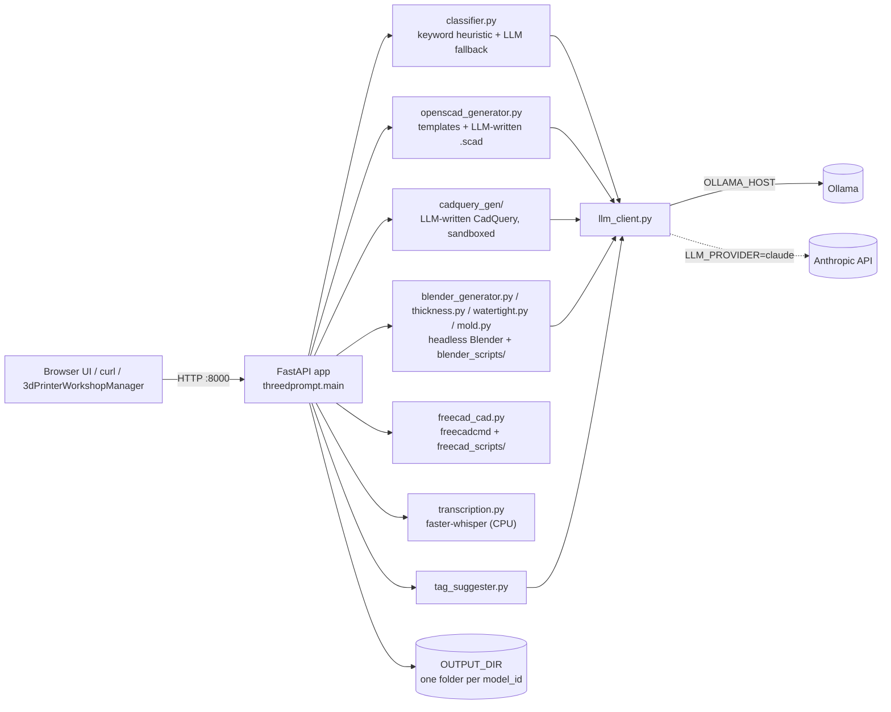

# Architecture

Verified against the code on 2026-10-04 (`src/threedprompt/`, `Dockerfile`,
`docker-compose.yml`, `.env.example`). One FastAPI process shells out to
OpenSCAD, Blender, FreeCAD and a sandboxed CadQuery child; one LLM backend
(Ollama or Claude) sits behind a small client abstraction. There is no
database and no authentication.

## Components

| Module | Role |
|---|---|
| `main.py` | All HTTP routes (`/health`, `/generate`, `/thicken`, `/mold`, `/models/{id}/...`, `/watertight/upload`, `/step/upload`, `/thumbnail`, `/tags/suggest`, `/transcribe`) and a `StaticFiles` mount of `static/` at `/` (`index.html`, `watertight.html`, vendored three.js). The static mount is registered last so API routes win. |
| `config.py` | The only place environment variables are read (`Settings` dataclass, module-level `settings`). |
| `classifier.py` | Keyword heuristic -> `simple` (OpenSCAD side) or `complex` (Blender side); if confidence < `CLASSIFIER_CONFIDENCE_THRESHOLD` the LLM classifies instead (ADR 0001). |
| `openscad_generator.py` | Built-in templates (bracket, box, plate, spacer) with no LLM call; otherwise LLM-authored OpenSCAD, one retry feeding the compiler error back. |
| `cadquery_gen/` | LLM-authored CadQuery run by `runner.py` in a subprocess sandbox (Landlock, seccomp, audit hook, rlimits, empty environment); the exported STL must pass `watertight.analyze_mesh`; one retry. Refuses to run without Landlock. |
| `blender_generator.py`, `blender_scripts/` | LLM-authored `bpy` for organic shapes; also the scripts for watertight analysis/repair, mold building, draft analysis, thumbnails. A vendored import_3dm reader handles Rhino `.3dm`. |
| `thickness.py`, `freecad_cad.py` | Wall thickening: OpenSCAD source regeneration -> FreeCAD Part Thickness (`.stl` only) -> Blender Solidify. FreeCAD also does STEP import/export and solid healing (ADR 0012). |
| `watertight.py`, `hole_classifier.py` | Hole/flipped-normal detection, heuristic intentional-vs-defect classification, repair, `viewer.glb` export. |
| `mold.py`, `draft_analysis.py` | Four mold modes, auto-repair before building, draft/undercut check, volume/mass reporting (ADRs 0005-0011). |
| `thumbnail.py`, `tag_suggester.py`, `transcription.py` | Library helpers for 3dPrinterWorkshopManager: PNG thumbnails, text-only LLM tag suggestions (heuristic fallback), local speech-to-text. |
| `storage.py` | Model folders, `spec.json`, prompt cache, zip helper. |
| `llm_client.py` | `OllamaClient` / `ClaudeClient` behind `get_llm_client()`. |

## Request flow: `POST /generate`

1. Reject empty prompts and prompts over `MAX_PROMPT_LENGTH` (422).
2. If `CACHE_ENABLED` and the identical `(prompt, wall_thickness_mm)` was
   generated before and its `model.stl` still exists, return that `model_id`.
3. Classify (heuristic, LLM fallback).
4. `complex` -> Blender (always LLM-authored `bpy`). `simple` -> CadQuery when
   `SIMPLE_LLM_BACKEND=cadquery`, the prompt matches no OpenSCAD template and
   Landlock is available (`_use_cadquery()`); otherwise OpenSCAD (template or
   LLM).
5. Any generator or LLM error -> the model folder is deleted and the API
   returns 503 with the message.
6. Write `spec.json`, remember the prompt in the cache index, return
   `model_id` and `download_url`.

## Storage

`OUTPUT_DIR` (`./output`; `/app/output` in the image, backed by the
`threedprompt_output` named volume) holds one folder per `model_id` (a UUID
hex): `model.stl` (or an upload's original mesh extension), the source
(`model.scad` / `part.py` / `build.py`) when kept, `spec.json`
(how the model was made - used by thickening to decide regenerate vs shell),
`viewer.glb` after analyze/repair, mold part STLs and `mold.zip`. A single
`_prompt_cache_index.json` at the root maps a hash of prompt+thickness to a
`model_id`. The Whisper model is cached under `<OUTPUT_DIR>/whisper-models`
by default. Nothing is ever deleted automatically; there is no backup (see
`TROUBLESHOOTING.md`).

## External processes and services

| Dependency | How it is used | Failure behaviour |
|---|---|---|
| OpenSCAD, Blender | subprocess per request, `CAD_SUBPROCESS_TIMEOUT_SECONDS` | `/health` -> `degraded`; endpoints 503 |
| FreeCAD (`freecadcmd`) | subprocess; success judged from a JSON report file, never the exit code | `/health` still `ok`; thickening falls back to Blender; STEP/solid-heal endpoints 503 |
| Ollama or Anthropic API | HTTP via `llm_client.py` | `LLMError` -> 503 (or a heuristic fallback for classification and tag suggestions) |
| faster-whisper | in-process, model downloaded on first `/transcribe` | 503 with the reason |

## Ports and deployment

| What | Port | Where set |
|---|---|---|
| App | host `8000` -> container `8000` | `docker-compose.yml` `ports:` and the Dockerfile `CMD`; fixed, no env override and no `launch.py` |
| Bundled Ollama | host `11434` | `docker-compose.yml` (`ollama` service) |
| lambda02 host Ollama | `11436` | `OLLAMA_HOST` in that host's `.env` |

**Local / default:** `docker compose up --build` starts `app` and the bundled
`ollama`. `OLLAMA_HOST=${OLLAMA_HOST:-http://ollama:11434}` in the compose
file means a value in `.env` wins and the bundled service is the fallback;
`.env.example` therefore ships `OLLAMA_HOST` commented out.

**lambda02:** `docker compose up -d --no-deps app` with
`OLLAMA_HOST=http://host.docker.internal:11436` in the host's untracked
`.env`, so the bundled `ollama` service is not started. `src/` is copied into
the image at build time (not bind-mounted), so code changes need `--build`.
`extra_hosts: host.docker.internal:host-gateway` makes the name resolve on
native Linux Docker.

The container runs as non-root `appuser` (uid 1000). The image installs
`rhino3dm` into Debian's system Python (the one apt's Blender links), not
the app's Python.

## Key design decisions

Each has an ADR in `docs/adr/`: hybrid heuristic+LLM classifier (0001),
OpenSCAD vs Blender split (0002), wall-thickness strategy (0003), heuristic
hole classification (0004), mold modes (0005-0011), FreeCAD as third backend
(0012), text-only tag suggestions (0013). Not in an ADR but visible in code:
the CadQuery sandbox refuses to run rather than fall back to unsandboxed
execution; FreeCAD results come from a report file because its exit code is
always 0; Ollama is the default LLM to keep running cost at zero, with Claude
opt-in via `LLM_PROVIDER=claude`.
